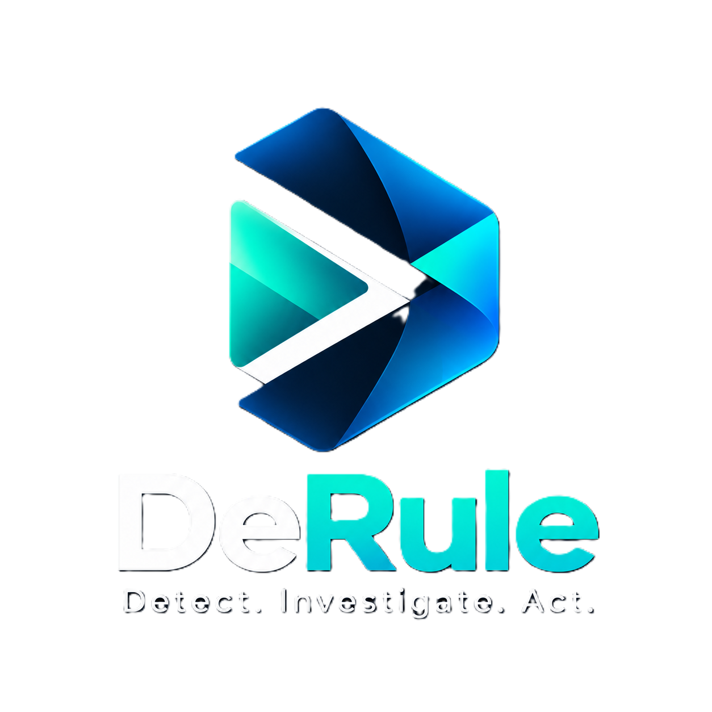
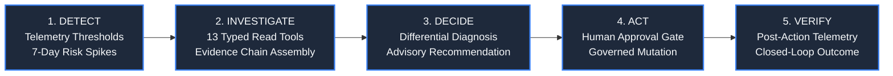
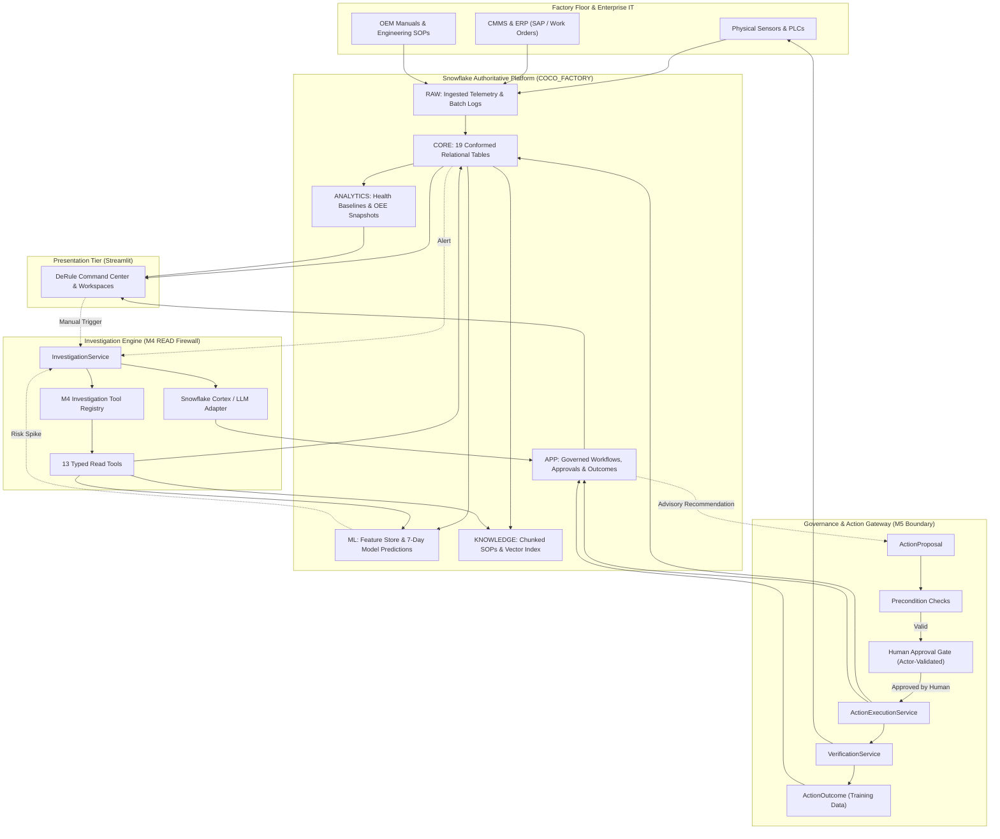
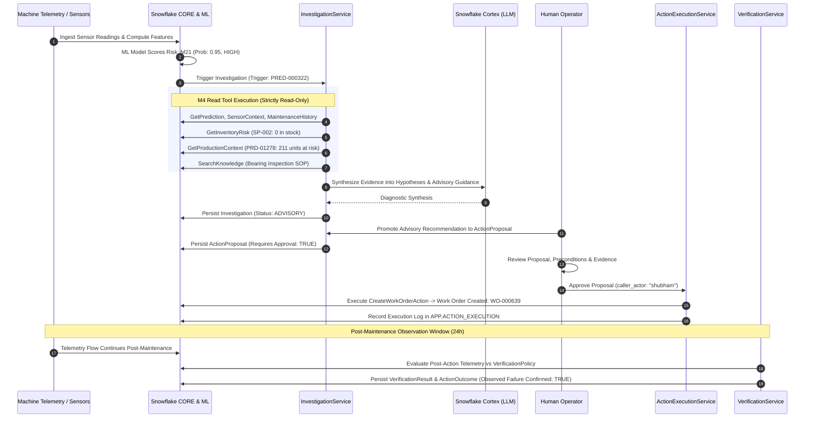
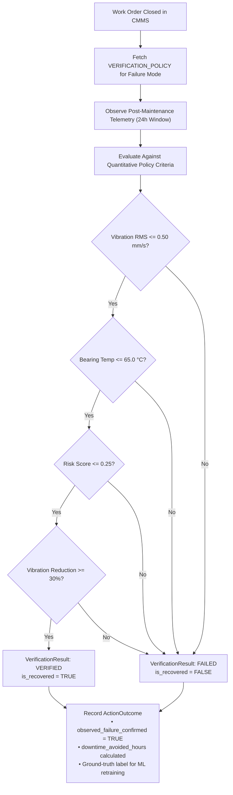

<p align="center">
  <picture>
    <source media="(prefers-color-scheme: dark)" srcset="logo/dark.png">
    <source media="(prefers-color-scheme: light)" srcset="logo/light.png">
    
  </picture>
</p>

<h1 align="center">DeRule</h1>

<p align="center">
  <strong>Detect. Investigate. Act.</strong>
</p>

<p align="center">
  An AI-powered industrial reliability and operations command center built natively around Snowflake. DeRule transforms high-frequency machine telemetry, production schedules, maintenance history, and engineering knowledge into evidence-grounded investigations, advisory recommendations, and governed, human-authorized operational actions.
</p>

<p align="center">
  <a href="https://www.python.org/"></a>
  <a href="https://streamlit.io/"></a>
  <a href="https://www.snowflake.com/"></a>
  <a href="https://scikit-learn.org/"></a>
  <a href="https://docs.pytest.org/"></a>
  <a href="LICENSE"></a>
  
</p>

---

## Table of Contents

- [1. Overview](#1-overview)
- [2. Why DeRule](#2-why-derule)
- [3. Core Capabilities](#3-core-capabilities)
- [4. Product Workflow](#4-product-workflow)
- [5. System Architecture](#5-system-architecture)
- [6. Agentic Investigation Layer (M4 READ Boundary)](#6-agentic-investigation-layer-m4-read-boundary)
- [7. Governance & Action Gateway (M5 Boundary)](#7-governance--action-gateway-m5-boundary)
- [8. Snowflake Data Architecture](#8-snowflake-data-architecture)
- [9. End-to-End Data Flow](#9-end-to-end-data-flow)
- [10. Canonical Flagship Scenario: M21 (Grinder 3)](#10-canonical-flagship-scenario-m21-grinder-3)
- [11. Closed-Loop Physical Verification](#11-closed-loop-physical-verification)
- [12. Performance & Scaling Profile](#12-performance--scaling-profile)
- [13. Technology Stack](#13-technology-stack)
- [14. Repository Structure](#14-repository-structure)
- [15. Quick Start](#15-quick-start)
- [16. Snowflake Configuration](#16-snowflake-configuration)
- [17. Environment Variables](#17-environment-variables)
- [18. Running Locally](#18-running-locally)
- [19. Testing Strategy](#19-testing-strategy)
- [20. Production Deployment Considerations](#20-production-deployment-considerations)
- [21. Security & Operational Guardrails](#21-security--operational-guardrails)
- [22. Data Model & Domain Ontology](#22-data-model--domain-ontology)
- [23. Documentation Map](#23-documentation-map)
- [24. Implementation Status](#24-implementation-status)
- [25. Product Roadmap](#25-product-roadmap)
- [26. Contributing](#26-contributing)
- [27. License & Disclaimer](#27-license--disclaimer)

---

## 1. Overview

**DeRule** is an enterprise-grade industrial reliability intelligence platform. It bridges the gap between raw sensor telemetry collected at the machine edge and actionable maintenance execution coordinated across plant operations.

Instead of presenting disjointed dashboards or relying on opaque black-box AI chatbots, DeRule enforces a structured, evidence-grounded operational cycle:
1. **Detects** impending equipment degradation using predictive machine learning models and statistical threshold monitors in Snowflake.
2. **Investigates** anomalies using a fleet of 13 typed, read-only tools that inspect machine history, sensor dynamics, inventory stock, and engineering manuals.
3. **Decides** root causes through differential diagnostic evaluation, producing strictly **advisory** recommendations.
4. **Acts** only through explicit human governance-routing actionable proposals through a strict human approval gateway before executing work orders or inventory reservations.
5. **Verifies** mechanical recovery by observing post-maintenance physical telemetry against quantitative verification policies.

Snowflake serves as the authoritative production system of record. Streamlit delivers the interactive command center UI.

---

## 2. Why DeRule

Traditional plant maintenance suffers from fragmented operational context:
* **Siloed Systems:** Vibration telemetry resides in OT historians, work orders sit in CMMS systems, production commitments are tracked in ERPs, and equipment manuals exist as scattered PDFs.
* **Alert Fatigue:** Threshold alarms fire continuously without correlating past failure modes or downstream business impacts.
* **Uncontrolled AI Agents:** Generic LLMs with write access or arbitrary SQL execution pose severe operational and safety hazards in industrial environments.
* **Premature Closeout:** Maintenance work orders are marked complete administratively without empirical verification that the machine is physically healthy.

DeRule solves these problems by establishing:
* **A Single Source of Truth:** A conformed 19-table industrial data model in Snowflake (`COCO_FACTORY`).
* **Typed Read-Only Tool Firewall:** An M4 investigation boundary with zero mutation authority and no arbitrary SQL execution.
* **Mandatory Human-in-the-Loop Governance:** Autonomous agents are strictly prohibited from approving consequential actions.
* **Closed-Loop Physical Verification:** Machine restoration is validated against actual sensor readings, calculating avoided downtime and generating verified training labels for future ML models.

---

## 3. Core Capabilities

| Capability | Description | Architectural Component |
| :--- | :--- | :--- |
| **Fleet Command Center** | Real-time monitoring of 25 industrial assets, plant-wide OEE, active risk scores, open alerts, and critical anomalies. | `app/streamlit/views/command_center.py` |
| **Predictive Maintenance** | 7-day degradation risk forecasting powered by a 29-feature gradient boosted classifier model. | `ml/models/failure_predictor.py` (`CORE.PREDICTION`) |
| **Agentic Investigation** | Autonomous, multi-source evidence gathering across telemetry, maintenance logs, ERP orders, and OEM SOPs. | `services/investigation_service.py` |
| **Differential Diagnosis** | Systematic evaluation of competing mechanical/electrical failure hypotheses with explicit evidence citations. | `domain/models/intelligence.py` (`Hypothesis`) |
| **Human Approval Gateway** | Governed authorization boundary with caller validation, expiration deadlines, and idempotency protection. | `services/approval_gateway.py` |
| **Governed Action Tools** | Typed mutation tools for work order creation, technician assignment, and spare parts reservation. | `tools/actions/` (`M5ActionRegistry`) |
| **Closed-Loop Verification** | Quantitative assessment of post-maintenance sensor readings against formal recovery policies. | `services/verification_service.py` |

---

## 4. Product Workflow

DeRule operates across five tightly governed phases:

$$\mathbf{DETECT} \longrightarrow \mathbf{INVESTIGATE} \longrightarrow \mathbf{DECIDE} \longrightarrow \mathbf{ACT} \longrightarrow \mathbf{VERIFY}$$



1. **DETECT:** Telemetry anomalies trigger threshold alerts in `CORE.ALERT`, while daily ML feature scoring flags high-risk machines in `CORE.PREDICTION`.
2. **INVESTIGATE:** `InvestigationService` deploys 13 typed read-only tools behind the M4 firewall to extract asset context, sensor dynamics, past work orders, supply chain status, and maintenance SOPs.
3. **DECIDE:** Snowflake Cortex / CoCo investigation adapter evaluates evidence to formulate competing hypotheses and outputs diagnostic findings alongside **advisory-only** recommendations.
4. **ACT:** Recommendations are promoted to formal `ActionProposal` records. Preconditions are validated, and a human operator authorizes execution via `ApprovalGateway`.
5. **VERIFY:** Following maintenance execution, `VerificationService` monitors real-time sensor data over a 24-hour window against a `VerificationPolicy` to empirically verify asset recovery.

---

## 5. System Architecture



---

## 6. Agentic Investigation Layer (M4 READ Boundary)

DeRule enforces an absolute security boundary around diagnostic investigations:
* **Strict Read-Only Mode:** All investigation tools inherit from `BaseReadTool` and enforce `ToolMode.READ`.
* **Action Firewall:** Any tool declaring a mutating mode or matching action verbs (`execute_sql`, `mutate`, `create_work_order`, `approve`, `purchase`) is rejected at startup with an `ActionFirewallError`.
* **Zero Arbitrary SQL:** The LLM cannot formulate or execute freeform SQL queries against Snowflake. All database queries are parameter-bound and schema-validated.

### The 13 Typed Read Tools

```text
tools/read/
├── prediction_tools.py
│   ├── GetPredictionTool             # Failure probability, risk band, horizon
│   ├── GetPredictionLineageTool      # Model version, feature snapshot ID, dataset lineage
│   └── GetFeatureSnapshotTool        # 29-feature vector scored at inference time
├── sensor_tools.py
│   └── GetSensorContextTool          # High-frequency telemetry, warn/crit thresholds, trends
├── asset_tools.py
│   ├── GetMachineContextTool         # Criticality, model specifications, installed components
│   └── GetMachineHealthTool          # Health assessment, active anomalies, OEE status
├── maintenance_tools.py
│   ├── GetMaintenanceHistoryTool     # Historical corrective and preventive work orders
│   └── GetHistoricalFailuresTool     # Recurring failure codes, fault classes, symptoms
├── downtime_tools.py
│   └── GetDowntimeHistoryTool        # Stoppage intervals, root-cause categories, durations
├── supply_chain_tools.py
│   ├── GetInventoryRiskTool          # Stock on hand, supplier lead time, warehouse bin
│   └── GetProductionContextTool      # Running orders, due dates, units at risk, exposure
└── knowledge_tools.py
    ├── SearchKnowledgeTool           # Semantic vector and keyword search across SOPs
    └── GetKnowledgeDocumentTool      # Full-text retrieval of OEM troubleshooting manuals
```

---

## 7. Governance & Action Gateway (M5 Boundary)

DeRule draws a hard architectural line between **advisory recommendations** and **consequential actions**:

```text
ADVISORY RECOMMENDATION ──► PROPOSAL ──► PRECONDITIONS ──► HUMAN APPROVAL ──► EXECUTION ──► VERIFICATION
      (Non-Executable)       (Formal)     (State Check)     (Human Actor)      (Receipt)     (Telemetry)
```

1. **Advisory Recommendations:** Persisted in `APP.INVESTIGATION_RECOMMENDATION` with status `ADVISORY`. They cannot mutate factory data.
2. **Promotion to Proposal:** A recommendation must be explicitly promoted to an `ActionProposal` in `APP.ACTION_PROPOSAL`.
3. **Precondition Validation:** `ActionPreconditionService` verifies operational prerequisites (e.g., confirming no conflicting work order is already active, verifying part availability). If preconditions fail, the proposal is marked `EXECUTION_BLOCKED`.
4. **Human Actor Validation:** `ApprovalGateway` validates the `caller_actor`. Blank, whitespace, or autonomous identities (e.g., `ReliabilityAgent`, `SYSTEM`) are strictly rejected.
5. **Approval Expiration:** Every approval has a mandatory `expires_at` timestamp. Expired approvals cannot be executed.
6. **Idempotency Protection:** Unique idempotency keys prevent duplicate work order creation or double reservations.
7. **Action Execution:** Once authorized, `ActionExecutionService` dispatches the typed action tool (`CreateWorkOrderAction`, `ReserveSparePartAction`, `AssignTechnicianAction`) and records an immutable receipt in `APP.ACTION_EXECUTION`.

---

## 8. Snowflake Data Architecture

The production database is `COCO_FACTORY`, structured into six conformed schemas:

| Schema | Purpose | Primary Tables / Views |
| :--- | :--- | :--- |
| **`RAW`** | Ingestion landing zone with file metadata. | `RAW.MACHINE`, `RAW.SENSOR_READING`, `RAW.MAINTENANCE_WORK_ORDER`, `RAW.KNOWLEDGE_DOC` |
| **`CORE`** | 19 conformed relational tables with primary and foreign key constraints. | `MACHINE`, `COMPONENT`, `SENSOR`, `SENSOR_READING`, `SENSOR_READING_HOURLY`, `PRODUCT`, `PRODUCTION_ORDER`, `PRODUCTION_RUN`, `DOWNTIME_EVENT`, `TECHNICIAN`, `MAINTENANCE_WORK_ORDER`, `MAINTENANCE_LOG`, `SUPPLIER`, `SPARE_PART`, `PURCHASE_ORDER`, `WO_PART_USAGE`, `ALERT`, `PREDICTION`, `KNOWLEDGE_DOC` |
| **`ANALYTICS`** | Pre-aggregated rollups for sub-second UI views. | `MACHINE_HEALTH_DAILY`, `MACHINE_OEE_DAILY`, `MACHINE_DOWNTIME_DAILY`, `MAINTENANCE_HISTORY`, `INVENTORY_RISK`, `PRODUCTION_RISK` |
| **`ML`** | Predictive modeling feature store and model registry. | `MODEL_REGISTRY`, `MACHINE_FEATURE_DAILY`, `INFERENCE_LOG`, `PREDICTION_FEATURE_SNAPSHOT`, `PREDICTION_LINEAGE` |
| **`KNOWLEDGE`** | Categorized corpus for semantic search. | `CORPUS` (chunked documents, failure modes, category tags, vector metadata) |
| **`APP`** | Governed investigation and action operational state. | `INVESTIGATION`, `INVESTIGATION_EVIDENCE`, `INVESTIGATION_HYPOTHESIS`, `INVESTIGATION_FINDING`, `INVESTIGATION_RECOMMENDATION`, `INVESTIGATION_TOOL_CALL`, `ACTION_PROPOSAL`, `ACTION_APPROVAL`, `ACTION_EXECUTION`, `ACTION_AUDIT`, `VERIFICATION_POLICY`, `VERIFICATION_RESULT`, `ACTION_OUTCOME` |

---

## 9. End-to-End Data Flow



---

## 10. Canonical Flagship Scenario: M21 (Grinder 3)

DeRule includes a fully documented, end-to-end canonical scenario based on machine **M21**:

* **Target Machine:** `M21` (*Grinder 3*) - Criticality: `CRITICAL`.
* **Component:** `C-M21-BRG` (*Drive-End Bearing*).
* **Observed Signals:** Vibration RMS elevated to $0.92\text{ mm/s}$ (warning threshold: $0.75\text{ mm/s}$), bearing temperature elevated to $74.2^\circ\text{C}$ (warning threshold: $75.0^\circ\text{C}$).
* **ML Failure Prediction:** `PRED-000322` ($P(\text{failure}) = 0.95$, risk: `HIGH`, horizon: 7 days, model: `hgb_failure_7d_v1`).
* **Supply Chain Context:** Spare part `SP-002` (*Drive-End Bearing 6206-2RS*) has `stock_qty = 0`, vendor lead time: 5 days, supplier: `SUP-12`.
* **Production Exposure:** Production order `PRD-01278` is actively running, with 211 units remaining, representing ₹83,134 at risk.
* **Canonical Investigation:** `INV-M21-20261002-001`.
* **Investigation Status:** `ADVISORY`.
* **Advisory Recommendation:** `INSPECT_BEARING_ASSEMBLY` (*Conduct non-invasive acoustic/vibration check during scheduled changeover*).

> [!IMPORTANT]
> **Truthfulness Rule:** In the canonical baseline data, M21's bearing is degrading, but has **not** suffered catastrophic failure. No physical maintenance, spare part reservation, or recovery has occurred on canonical M21 data.

---

## 11. Closed-Loop Physical Verification

Administrative work order closure does not equal mechanical restoration. DeRule enforces closed-loop physical verification:



* **Policy Criteria:** Evaluates post-maintenance sensor telemetry against engineering limits defined in `APP.VERIFICATION_POLICY`.
* **Physical Telemetry Proof:** Requires observed reductions in vibration RMS ($\ge 30\%$) and temperature ($\le 65^\circ\text{C}$).
* **Ground-Truth Label Generation:** Successful verifications generate verified labels in `APP.ACTION_OUTCOME` to close the machine learning feedback loop.

---

## 12. Performance & Scaling Profile

During local and live Snowflake validation passes, the DeRule Command Center underwent performance optimization:

| Metric | Unoptimized Baseline | Optimized DeRule Architecture | Improvement |
| :--- | :--- | :--- | :--- |
| **Total Command Center Load Time** | 244.091 seconds | **3.280 seconds** | **74x Speedup** |
| **Snowflake Queries per Load** | 69 queries | **9 queries** | **87% Reduction** |
| **Query Scaling Across Fleet** | $O(N)$ (linear per machine) | **$O(1)$ (scale-invariant)** | Constant Query Load |

> [!NOTE]
> These numbers represent measured local/live Snowflake profiling results on a 25-machine factory fleet, not universal service level agreements (SLAs).

### Key Architectural Optimizations:
1. **$O(1)$ Batch Repository APIs:** Eliminated $N+1$ query loops by fetching fleet-wide feature snapshots, OEE statistics, and health metrics in aggregated queries (`get_latest_features_batch`, `get_fleet_oee_summary`).
2. **`CommandCenterSnapshot`:** Unified aggregation model in `app/streamlit/services/view_service.py` that hydrates all dashboard components in a single pass.
3. **Session-Level TTL Caching:** Implemented a short 10-second cache TTL to ensure instant UI responsiveness while preserving telemetry freshness.
4. **Connection Pooling Proxy (`_PooledConnectionProxy`):** Reuses active Snowflake connection handles across Streamlit reruns, eliminating repeated TLS handshake and authentication overhead.

---

## 13. Technology Stack

- **Presentation Layer:** [Streamlit](https://streamlit.io/) (Interactive web interface, custom responsive industrial theme, dark/light modes)
- **Data & Intelligence Platform:** [Snowflake](https://www.snowflake.com/) (`COCO_FACTORY` database, 6 schemas, conformed relational model)
- **AI & Evidence Synthesis:** Snowflake Cortex LLM functions, CoCo Investigation Adapter, deterministic diagnostic fallback
- **Predictive Machine Learning:** [scikit-learn](https://scikit-learn.org/) (`HistGradientBoostingClassifier`, 29 engineered rolling features, 7-day failure horizon)
- **Core Backend:** Python 3.11+, [Pydantic v2](https://docs.pydantic.dev/) (Strict domain validation), Repository Abstraction Pattern
- **Testing & Verification:** [pytest](https://docs.pytest.org/) (430+ unit, domain, and security firewall tests), Streamlit `AppTest`

---

## 14. Repository Structure

```text
coco/
├── app/                              # Streamlit application tier
│   ├── streamlit_app.py              # Application entrypoint
│   └── streamlit/
│       ├── components/               # UI components (cards, tables, timelines)
│       ├── services/                 # ViewService, CommandCenterSnapshot, caching
│       └── views/                    # Workspaces (Command Center, Investigations, Assets)
├── domain/                           # Pure business domain entities & validation
│   ├── enums/                        # ActionStatus, ApprovalStatus, ToolMode, FailureMode
│   └── models/                       # Pydantic models (Investigation, Proposal, Outcome)
├── services/                         # Core application business logic
│   ├── investigation_service.py      # M4 investigation orchestrator
│   ├── approval_gateway.py           # Human approval verification gate
│   ├── action_execution_service.py   # Governed M5 execution coordinator
│   ├── action_precondition_service.py# Operational prerequisite validation
│   └── verification_service.py       # Closed-loop telemetry evaluation
├── tools/                            # Governed tool catalogs
│   ├── read/                         # 13 typed M4 read tools (ToolMode.READ)
│   ├── actions/                      # Governed M5 action tools (ToolMode.ACTION)
│   └── registry.py                   # M4 tool registry & action firewall
├── repositories/                     # Persistence abstraction layer
│   ├── base.py                       # Abstract repository contracts
│   ├── snowflake/                    # Authoritative Snowflake implementations
│   └── memory/                       # Isolated test fixtures
├── ml/                               # Predictive maintenance models & feature pipelines
├── snowflake/ddl/coco_factory/       # Authoritative Snowflake DDL & setup scripts
├── logo/                             # Official branding assets (light.png, dark.png)
├── tests/                            # Test suite (unit, integration, UI rendering)
├── architecture/                     # Technical specifications & domain ontologies
│   ├── architecture.md               # Authoritative system architecture document
│   ├── ontology.md                   # Formal domain ontology & ER relationships
│   └── agent-workflows.md            # Multi-agent investigation specifications
├── requirements.txt                  # Python dependencies
├── .env.example                      # Template environment configuration
└── LICENSE                           # MIT License
```

---

## 15. Quick Start

### Prerequisites
- Python 3.11 or higher
- Git
- Access to a Snowflake account (or run with isolated in-memory test fixtures)

### Setup Instructions

1. **Clone the repository:**
   ```bash
   git clone https://github.com/sonalhonny71/CoCoProject.git
   cd CoCoProject
   ```

2. **Create and activate a virtual environment:**
   ```bash
   # Linux / macOS
   python -m venv .venv
   source .venv/bin/activate

   # Windows (PowerShell)
   python -m venv .venv
   .\.venv\Scripts\Activate.ps1
   ```

3. **Install dependencies:**
   ```bash
   pip install -r requirements.txt
   ```

4. **Configure environment variables:**
   ```bash
   cp .env.example .env
   # Edit .env with your Snowflake credentials (or keep STORAGE_BACKEND=in_memory for offline evaluation)
   ```

5. **Launch DeRule:**
   ```bash
   streamlit run app/streamlit_app.py
   ```
   Open your browser at `http://localhost:8501`.

---

## 16. Snowflake Configuration

To deploy DeRule against a live Snowflake account, execute the DDL scripts in sequence from `snowflake/ddl/coco_factory/`:

```sql
-- 1. Database & Schemas
!source snowflake/ddl/coco_factory/00_database.sql;
!source snowflake/ddl/coco_factory/01_schemas.sql;

-- 2. Conformed Tables
!source snowflake/ddl/coco_factory/10_raw_tables.sql;
!source snowflake/ddl/coco_factory/20_core_tables.sql;
!source snowflake/ddl/coco_factory/30_analytics_foundation.sql;
!source snowflake/ddl/coco_factory/40_ml_foundation.sql;
!source snowflake/ddl/coco_factory/50_knowledge_foundation.sql;
!source snowflake/ddl/coco_factory/60_app_foundation.sql;
```

---

## 17. Environment Variables

Configure application settings in `.env` (derived from `.env.example`):

| Variable | Description | Default / Example |
| :--- | :--- | :--- |
| `STORAGE_BACKEND` | Storage persistence provider (`in_memory` or `snowflake`). | `in_memory` |
| `SNOWFLAKE_ACCOUNT` | Snowflake account locator. | `xy12345.us-east-1` |
| `SNOWFLAKE_USER` | Snowflake username. | `RELIABILITY_USER` |
| `SNOWFLAKE_PASSWORD` | Password (if using password auth). | *None* |
| `SNOWFLAKE_PRIVATE_KEY_PATH`| Path to PKCS#8 private key (for key-pair auth). | *None* |
| `SNOWFLAKE_WAREHOUSE` | Compute warehouse. | `COMPUTE_WH` |
| `SNOWFLAKE_DATABASE` | Target database. | `COCO_FACTORY` |
| `SNOWFLAKE_SCHEMA` | Default operational schema. | `CORE` |
| `SNOWFLAKE_ROLE` | User role with operational access. | `RELIABILITY_ENGINEER` |
| `COCO_FACTORY_SOURCE_ROOT` | Path to canonical source data CSV files. | `data/` |
| `ANOMALY_ZSCORE_THRESHOLD` | Statistical z-score limit for sensor anomalies. | `2.5` |
| `FAILURE_RISK_ALERT_THRESHOLD` | Threshold to trigger high-risk predictive alert. | `0.65` |

---

## 18. Running Locally

To run DeRule locally on Windows:
```powershell
.\.venv\Scripts\Activate.ps1
streamlit run app\streamlit_app.py
```

To run on Linux / macOS:
```bash
source .venv/bin/activate
streamlit run app/streamlit_app.py
```

The application initializes the DeRule shell and connects to the configured storage backend.

---

## 19. Testing Strategy

DeRule maintains a rigorous, multi-tiered testing suite:

```bash
# Execute standard non-live unit, domain, and security tests (430+ tests):
pytest tests/ -k "not live and not integration"

# Run UI rendering and HTML leak prevention tests:
pytest tests/test_ui_rendering.py tests/test_ui_canonical_investigation_view.py

# Run M4 read firewall and M5 action boundary tests:
pytest tests/test_action_execution_boundary.py tests/test_action_proposal_handoff.py
```

* **Live Snowflake Tests:** Tests requiring active Snowflake connectivity are marked `@pytest.mark.live` and separated from the default CI suite.
* **Read-Only Live Validation:** Live Snowflake tests operate strictly with `SELECT` queries and never mutate production data.
* **No Live Mutations in Regression:** Operational actions are tested against isolated test fixtures.

---

## 20. Production Deployment Considerations

When moving DeRule into enterprise production environments:
1. **Key-Pair Authentication:** Configure RSA key-pair authentication (`SNOWFLAKE_PRIVATE_KEY_PATH`) instead of static passwords.
2. **Role-Based Access Control (RBAC):** Create dedicated roles (`RELIABILITY_READ`, `RELIABILITY_APP`) with least-privilege grants on `COCO_FACTORY` schemas.
3. **Snowpipe Streaming:** Replace batch CSV replays with Snowpipe Streaming for real-time sub-second telemetry ingestion.
4. **Streamlit Deployment:** Deploy the presentation layer using Snowflake Native Apps or containerized services (Snowpark Container Services / Kubernetes).

---

## 21. Security & Operational Guardrails

DeRule enforces eleven non-negotiable operational guardrails:

1. **Snowflake is Authoritative:** Streamlit never acts as an independent data store.
2. **M4 READ Firewall:** Diagnostic tools are strictly read-only and cannot mutate data.
3. **No Arbitrary SQL:** Neither LLMs nor end users can submit unvetted SQL queries.
4. **No Autonomous Self-Approval:** AI agents cannot approve action proposals.
5. **Human Actor Validation:** Approval and execution endpoints reject non-human or blank actors.
6. **Time-Bound Approvals:** All approvals expire after a configurable duration.
7. **Precondition Gating:** Execution is blocked if equipment states or inventory requirements are invalid.
8. **Idempotent Mutations:** Unique deduplication keys prevent accidental duplicate actions.
9. **Physical Verification:** Telemetry must empirically demonstrate recovery before closing the loop.
10. **Immutable Auditing:** Every tool execution and approval decision is logged to audit tables.
11. **Truthful AI Provenance:** Diagnostic summaries explicitly declare whether Cortex or deterministic fallback models were used.

---

## 22. Data Model & Domain Ontology

The full domain ontology is documented in [architecture/ontology.md](architecture/ontology.md).

It formalizes:
* **20 Factory Core Entities:** Plant, Line, Machine, Component, Sensor, Sensor Reading, Alert, Prediction, Failure Mode, Maintenance Work Order, Maintenance Log, Technician, Spare Part, Supplier, Purchase Order, Production Order, Production Run, Downtime Event, Product, Knowledge Document.
* **6 AI Investigation Entities:** Investigation, Evidence, Hypothesis, Finding, Recommendation, Tool Call.
* **6 Governed Action Entities:** Action Proposal, Action Approval, Action Execution, Verification Policy, Verification Result, Action Outcome.

---

## 23. Documentation Map

- [`architecture/architecture.md`](architecture/architecture.md): Complete technical architecture, layered design, performance profiling, and sequence diagrams.
- [`architecture/ontology.md`](architecture/ontology.md): Formal entity taxonomy, Snowflake schema mappings, lifecycles, and entity-relationship diagrams.
- [`architecture/agent-workflows.md`](architecture/agent-workflows.md): Multi-agent investigation specifications, tool orchestration patterns, and prompt contracts.
- [`snowflake/ddl/coco_factory/`](snowflake/ddl/coco_factory/): Authoritative SQL DDL scripts for all database schemas and tables.

---

## 24. Implementation Status

| Component | Status | Verification Detail |
| :--- | :---: | :--- |
| **Snowflake 19-Table CORE Schema** | **Complete** | Validated via `snowflake/ddl/coco_factory/20_core_tables.sql` |
| **29-Feature Predictive Failure Model** | **Complete** | Scored 7-day horizon (`hgb_failure_7d_v1`) in `ml/models/` |
| **M4 Investigation Tool Registry** | **Complete** | 13 typed read tools enforced behind action firewall |
| **Cortex Investigation Adapter** | **Complete** | Evidence synthesis with deterministic fallback |
| **M5 Governed Action Registry** | **Complete** | Typed action tools requiring validated human approval |
| **Human Approval Gateway** | **Complete** | Actor validation, expiration, and idempotency checks |
| **Closed-Loop Verification Engine** | **Complete** | Evaluates post-maintenance sensor telemetry vs policy |
| **Command Center $O(1)$ Optimization** | **Complete** | Latency reduced from 244s to 3.28s (74x speedup) |
| **Industrial UI Workspaces** | **Complete** | Command Center, Investigations, Assets, Governance |

---

## 25. Product Roadmap

### Completed (v2.0 Core)
- [x] Conformed Snowflake operational schemas and DDL scripts.
- [x] Supervised predictive failure modeling on 25 industrial assets.
- [x] M4 read-only investigation engine and evidence collection tools.
- [x] M5 human-in-the-loop action approval gateway and execution framework.
- [x] Closed-loop physical telemetry verification engine.
- [x] Command Center $O(1)$ batch query performance optimization.

### In Progress
- [ ] **ACTION_OUTCOME Schema Migration:** Deploying final audit columns (`execution_id`, `verification_id`, `telemetry_provenance`, `is_simulated_telemetry`) to live production Snowflake instances.
- [ ] **Real-Time Telemetry Streaming:** Integrating Snowpipe Streaming for sub-second sensor ingestion.

### Planned
- [ ] **Enterprise CMMS Integrations:** Native API connectors for SAP PM, IBM Maximo, and ServiceNow.
- [ ] **Snowflake Native App Packaging:** Packaging DeRule for single-click installation via Snowflake Marketplace.

---

## 26. Contributing

We welcome contributions to DeRule. Please adhere to the following guidelines:

1. **Branch Workflow:** Create feature branches off `main` (`feature/your-feature-name` or `fix/your-fix-name`).
2. **Strict Non-Live Rule:** Never execute mutating queries against canonical Snowflake environments during local testing.
3. **Architectural Guardrails:** Preserve the separation between M4 (Read-Only) and M5 (Governed Action). Do not introduce arbitrary SQL capabilities.
4. **Testing Standards:** All pull requests must pass the complete test suite:
   ```bash
   pytest tests/ -k "not live and not integration"
   ```
5. **Documentation Integrity:** Update corresponding sections in `architecture/architecture.md` and `architecture/ontology.md` if modifying data models or interfaces.

---

## 27. License & Disclaimer

### License
DeRule is licensed under the **MIT License**. See the [LICENSE](LICENSE) file for details.

### Industrial Operational Safety Disclaimer
DeRule is an AI-assisted operational decision support system. In physical industrial environments, all maintenance actions, machine shutdowns, and equipment interventions must be reviewed and authorized by certified plant reliability personnel in accordance with established environmental health and safety (EHS) and plant standard operating procedures (SOPs).

