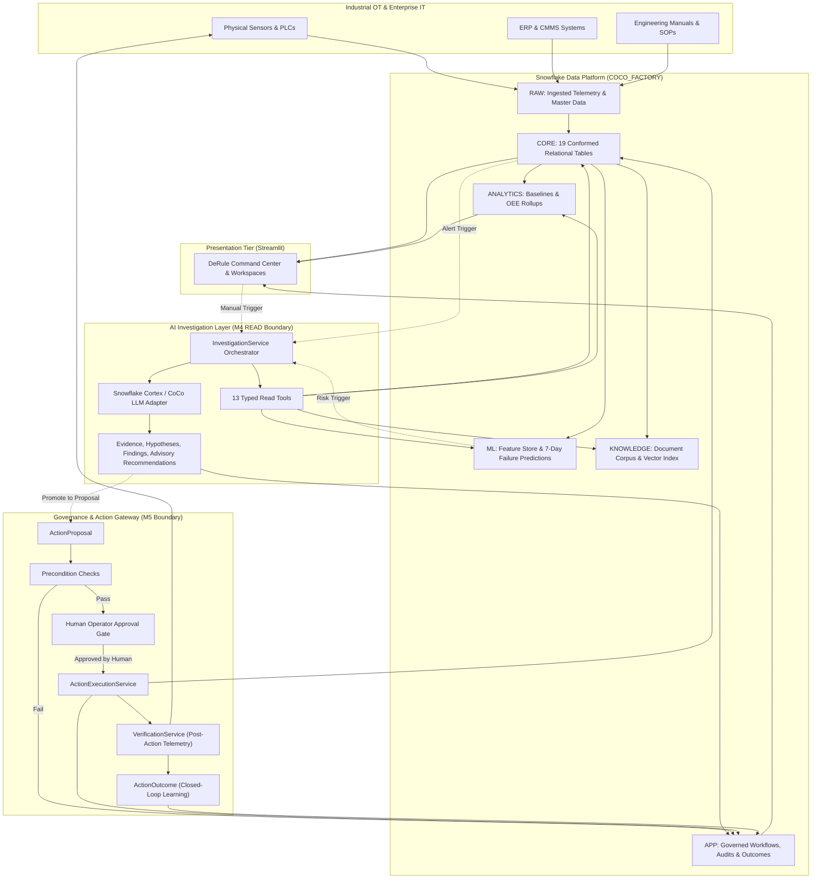
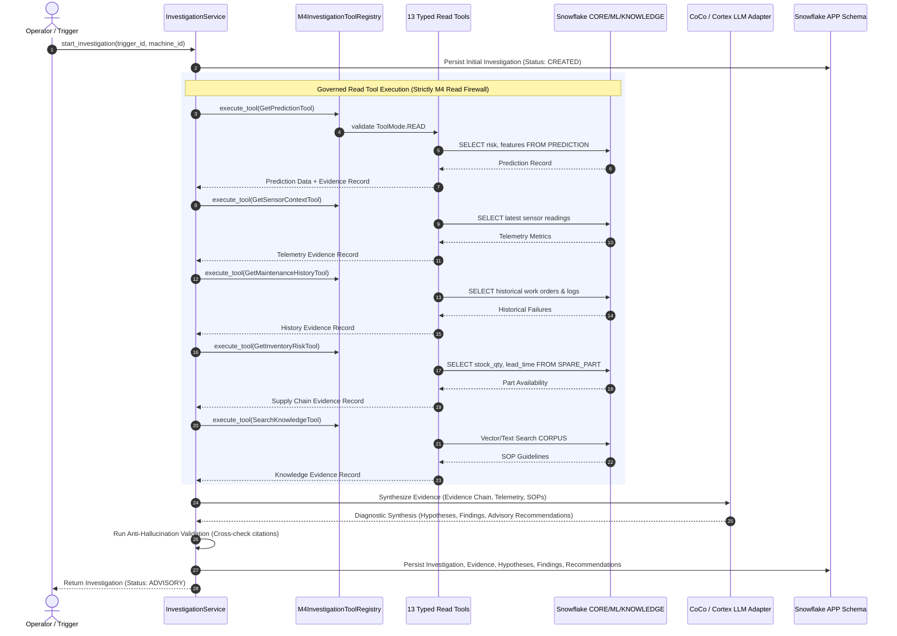
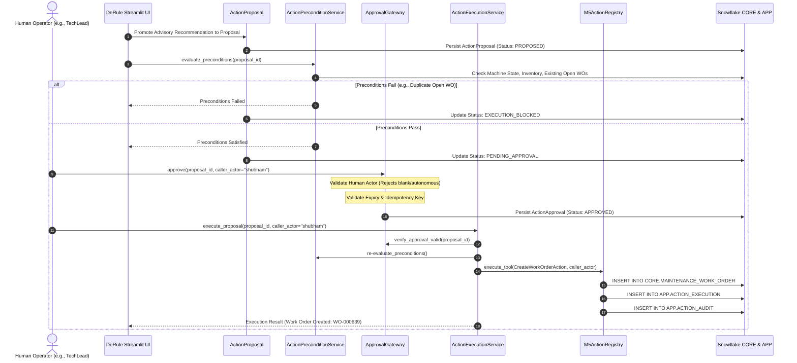
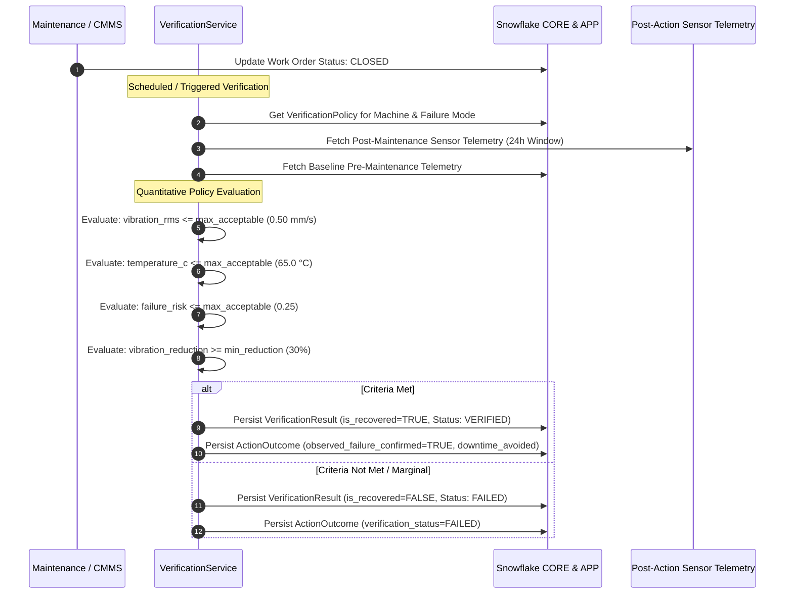

# DeRule System Architecture

**Document:** `architecture/architecture.md`
**Version:** 2.0
**Status:** Authoritative Technical Architecture
**Product:** DeRule — *Detect. Investigate. Act*
**Tagline:** Detect. Investigate. Act
**Primary Platform:** Snowflake (`COCO_FACTORY`)
**Application Surface:** Streamlit (`app/streamlit_app.py`)
**AI Surface:** Snowflake Cortex + CoCo Investigation Adapter
**Architecture Style:** Governed, Data-Centric, Agentic, Closed-Loop

---

# 1. Architectural Principles

DeRule is built upon five non-negotiable architectural principles that govern all data flow, reasoning, and operational execution:

1. **Snowflake is the Authoritative System of Record:**
   The application tier (Streamlit) is strictly presentation and human interaction. In-memory data structures are reserved for transient caching and isolated test fixtures. In production, every operational state, prediction, investigation artifact, approval record, and execution log must be authoritatively committed to Snowflake (`COCO_FACTORY`).

2. **Strict Separation of Read Investigation (M4) and Governed Action (M5):**
   Diagnostic investigation and physical/operational mutation are decoupled by design. The investigation layer operates behind a strict **M4 Read Firewall**, with zero write authority over work orders, inventory, or machine states. All diagnostic recommendations are strictly **ADVISORY**. Consequential actions require formal promotion to an `ActionProposal` and human operator authorization.

3. **Mandatory Human-in-the-Loop Governance (No Autonomous Self-Approval):**
   AI agents cannot approve their own recommendations or trigger physical actions autonomously. Every consequential mutation (work order generation, spare part reservation, technician dispatch) requires explicit authorization by a validated human operator. Server-side validation rejects any attempt by autonomous or blank actors to grant approval.

4. **Typed Tools Over Arbitrary SQL:**
   Neither the LLM nor the investigation orchestrator is granted unrestricted SQL execution capabilities. All database interactions occur through a catalog of 13 typed, schema-validated, read-only tools that enforce parameter validation, query budgeting, and comprehensive execution auditing.

5. **Closed-Loop Physical Verification:**
   Maintenance completion is not treated as operational restoration. Closing a work order administratively does not prove mechanical health. DeRule evaluates post-action physical sensor telemetry against quantitative verification policies to verify physical asset recovery and avoid false recoveries.

---

# 2. System Context & End-to-End Loop

DeRule executes a closed-loop operational workflow:

$$\text{DETECT} \longrightarrow \text{INVESTIGATE} \longrightarrow \text{DECIDE} \longrightarrow \text{ACT} \longrightarrow \text{VERIFY}$$



---

# 3. Layered Architecture

DeRule follows a strict hexagonal/layered architecture enforcing unidirectional dependencies:

```text
┌────────────────────────────────────────────────────────────────────────┐
│                   PRESENTATION TIER (Streamlit)                        │
│  app/streamlit_app.py                                                  │
│  ├── Views: Command Center, Investigations, Assets, OEE, Governance    │
│  ├── Components: Header, Sidebar, Metric Cards, Evidence, Timelines    │
│  └── Services: ViewService (CommandCenterSnapshot, TTL Cache)          │
└───────────────────────────────────┬────────────────────────────────────┘
                                    │
                                    ▼
┌────────────────────────────────────────────────────────────────────────┐
│                     APPLICATION SERVICES TIER                          │
│  services/                                                             │
│  ├── InvestigationService: Orchestrates M4 tools & LLM diagnosis       │
│  ├── ApprovalGateway / ApprovalService: Validates human governance     │
│  ├── ActionExecutionService: Executes authorized operational actions   │
│  ├── ActionPreconditionService: Evaluates execution prerequisites     │
│  ├── VerificationService: Evaluates post-maintenance sensor telemetry  │
│  └── AlertService, AnomalyService, OeeService, PredictionService       │
└───────────────────────────────────┬────────────────────────────────────┘
                                    │
                                    ▼
┌────────────────────────────────────────────────────────────────────────┐
│                      DOMAIN & TOOL BOUNDARIES                          │
│  domain/                                                               │
│  ├── enums: ActionStatus, ApprovalStatus, ToolMode, FailureMode        │
│  └── models: Investigation, Evidence, Hypothesis, Proposal, Approval   │
│  tools/                                                                │
│  ├── read/ (M4 Registry): 13 Typed Read Tools (Strictly ToolMode.READ) │
│  └── actions/ (M5 Registry): Typed Mutating Tools (Human Gate Required)│
└───────────────────────────────────┬────────────────────────────────────┘
                                    │
                                    ▼
┌────────────────────────────────────────────────────────────────────────┐
│                     REPOSITORY & PERSISTENCE TIER                      │
│  repositories/                                                         │
│  ├── base.py: Abstract Repository Interfaces                           │
│  ├── snowflake/: Production Snowflake Repositories (Relational & App)  │
│  └── memory/: Isolated Test Fixtures (Never invoked in production)     │
└───────────────────────────────────┬────────────────────────────────────┘
                                    │
                                    ▼
┌────────────────────────────────────────────────────────────────────────┐
│                      DATA PLATFORM (Snowflake)                         │
│  COCO_FACTORY: RAW, CORE, ANALYTICS, ML, KNOWLEDGE, APP                │
└────────────────────────────────────────────────────────────────────────┘
```

---

# 4. Snowflake Data Architecture

The Snowflake database `COCO_FACTORY` contains six purpose-built schemas:

```text
COCO_FACTORY
├── RAW          # Append-only staging for ingested sensor and ERP batches
├── CORE         # 19 conformed, relational master data tables
├── ANALYTICS    # Aggregation views, daily health metrics, and OEE rollups
├── ML           # Feature store, model registry, inference logs, and lineage
├── KNOWLEDGE    # Chunked maintenance manuals, SOPs, and vector search index
└── APP          # Governed workflow state, human approvals, and execution logs
```

### 4.1 Schema Breakdown

1. **`RAW`:** Ingestion landing zone with file metadata (`_SOURCE_FILE`, `_LOADED_AT`). Preserves raw records before transformation.
2. **`CORE`:** 19 relational tables enforcing primary/foreign key constraints:
   * **Assets & Topology:** `MACHINE`, `COMPONENT`, `SENSOR`.
   * **Telemetry:** `SENSOR_READING` (raw minute stream), `SENSOR_READING_HOURLY` (running-only aggregates).
   * **Operations & Maintenance:** `PRODUCTION_ORDER`, `PRODUCTION_RUN`, `DOWNTIME_EVENT`, `MAINTENANCE_WORK_ORDER`, `MAINTENANCE_LOG`, `TECHNICIAN`.
   * **Supply Chain:** `PRODUCT`, `SPARE_PART`, `SUPPLIER`, `PURCHASE_ORDER`, `WO_PART_USAGE`.
   * **Intelligence:** `ALERT`, `PREDICTION`, `KNOWLEDGE_DOC`.
3. **`ANALYTICS`:** Pre-aggregated views supporting interactive Command Center responsiveness without runtime table scans:
   * `MACHINE_HEALTH_DAILY`, `MACHINE_OEE_DAILY`, `MACHINE_DOWNTIME_DAILY`, `MAINTENANCE_HISTORY`, `INVENTORY_RISK`, `PRODUCTION_RISK`.
4. **`ML`:** Predictive maintenance operational infrastructure:
   * `MODEL_REGISTRY`: Tracks algorithms, AUC-ROC, PR-AUC, parameters, and training datasets.
   * `MACHINE_FEATURE_DAILY`: 29-feature daily vector per machine (rolling statistics, baseline ratios).
   * `INFERENCE_LOG`: Production record of every batch and ad-hoc model inference.
   * `PREDICTION_FEATURE_SNAPSHOT` & `PREDICTION_LINEAGE`: Complete feature provenance for every risk score.
5. **`KNOWLEDGE`:**
   * `CORPUS`: Normalized, categorized repository of SOPs, troubleshooting manuals, and OEM guides indexed for semantic and keyword retrieval.
6. **`APP`:** Governed application operational state:
   * `INVESTIGATION`, `INVESTIGATION_EVIDENCE`, `INVESTIGATION_HYPOTHESIS`, `INVESTIGATION_FINDING`, `INVESTIGATION_RECOMMENDATION`, `INVESTIGATION_TOOL_CALL`.
   * `ACTION_PROPOSAL`, `ACTION_APPROVAL`, `APPROVAL_AUDIT`, `ACTION_EXECUTION`, `ACTION_AUDIT`.
   * `VERIFICATION_POLICY`, `VERIFICATION_RESULT`, `ACTION_OUTCOME`.

---

# 5. Repository Abstraction Layer

DeRule implements the Repository Pattern (`repositories/base.py`) to decouple business logic from underlying storage mechanics:

* **Production Backend (`STORAGE_BACKEND=snowflake`):**
  Uses `repositories/snowflake/` to execute parameter-bound SQL statements against Snowflake tables. In production, this backend is strictly authoritative.
* **Isolated Test Backend (`STORAGE_BACKEND=in_memory`):**
  Uses `repositories/memory/` for deterministic unit testing. It mirrors domain interfaces without contacting external infrastructure.
* **No Silent Production Fallback:**
  If Snowflake connectivity fails in production, the application surfaces an explicit operational error. It **never** silently falls back to in-memory fixtures.

---

# 6. Investigation Architecture (M4 Boundary)

The investigation engine operates strictly under the **M4 Read Boundary**:



### 6.1 The 13 Typed M4 Read Tools

1. `GetPredictionTool`: Retrieves model failure probability, risk band, and target horizon.
2. `GetPredictionLineageTool`: Traces prediction back to exact model version, feature snapshot, and training dataset.
3. `GetFeatureSnapshotTool`: Retrieves the exact 29-feature vector scored by the ML model.
4. `GetSensorContextTool`: Extracts current running sensor telemetry, warning thresholds, and recent trends.
5. `GetMachineContextTool`: Returns asset metadata, criticality, model, and operational specifications.
6. `GetMachineHealthTool`: Summarizes health status, active anomalies, and recent downtime.
7. `GetMaintenanceHistoryTool`: Retrieves past corrective and preventive work orders for the machine.
8. `GetHistoricalFailuresTool`: Identifies recurring failure modes and past root causes.
9. `GetDowntimeHistoryTool`: Quantifies past unplanned downtime and stoppage durations.
10. `GetInventoryRiskTool`: Checks on-hand stock quantities, reorder points, vendor lead times, and open POs.
11. `GetProductionContextTool`: Evaluates running production orders, remaining units, due dates, and financial exposure.
12. `SearchKnowledgeTool`: Executes semantic and keyword queries against maintenance SOPs and manuals.
13. `GetKnowledgeDocumentTool`: Retrieves full-text maintenance procedures and OEM technical guidelines.

### 6.2 The M4 Read Firewall
The tool registry (`tools/registry.py`) enforces strict security checks on every tool registration:
* Tools must explicitly declare `ToolMode.READ`.
* Tool names matching mutating patterns (`execute_sql`, `run_query`, `mutate`, `create_work_order`, `approve`, `purchase`) are rejected with `ActionFirewallError`.
* Arbitrary SQL execution is strictly forbidden.

---

# 7. Cortex Adapter & Truthful Provenance

DeRule integrates with Snowflake Cortex for diagnostic evidence synthesis:
* **Evidence Synthesis:** Cortex evaluates collected facts to perform differential diagnosis across competing failure hypotheses.
* **Deterministic Fallback:** If Cortex is unavailable or unconfigured, the `InvestigationService` falls back to a deterministic rules-based expert diagnostic engine.
* **Truthful Provenance:** Every investigation records its exact diagnostic provenance (`model_name`, `provider`, `latency_ms`, `evidence_count`, `fallback_used`). It never falsely claims Cortex execution when deterministic synthesis was used.
* **Anti-Hallucination Guardrails:** The service cross-validates every finding and hypothesis against persisted `evidence_id` foreign keys. Any LLM assertion that cites non-existent evidence is discarded.

---

# 8. Governed Action Architecture (M5 Boundary)

The **M5 Action Boundary** controls all operational modifications:



### 8.1 Governance Controls
1. **Advisory Promotion:** Recommendations in `APP.INVESTIGATION_RECOMMENDATION` are immutable advisory records. They cannot be executed directly; they must be formally promoted to an `ActionProposal`.
2. **Actor Validation:** Server-side validation via `ApprovalGateway` and `ActionExecutionService` rejects non-human, whitespace, or autonomous caller identities (e.g., `ReliabilityAgent`, `SYSTEM`, `""`).
3. **Approval Expiry:** Every approval record carries a mandatory `expires_at` deadline. Expired approvals cannot be executed.
4. **Idempotency Keys:** Every proposal and execution specifies an `idempotency_key` (derived from machine ID, action type, and date) to prevent double execution.
5. **Precondition Checks:** `ActionPreconditionService` validates physical and operational prerequisites (asset operational state, stock availability, no conflicting open work orders). If a prerequisite fails, the proposal transitions to `EXECUTION_BLOCKED`.

---

# 9. Closed-Loop Physical Verification Architecture

DeRule does not equate administrative work order closure with operational restoration:



* **Quantitative Policy:** `VERIFICATION_POLICY` defines engineering bounds (`max_acceptable_vibration_rms`, `max_acceptable_temperature`, `min_vibration_reduction_pct`).
* **Sensor-Based Evaluation:** Evaluates real post-maintenance physical telemetry over observation windows (e.g., 24 hours).
* **Ground-Truth Label Generation:** The final `ActionOutcome` captures verified physical recovery, calculates avoided downtime hours, and generates confirmed historical training labels for future ML model retraining.

---

# 10. Command Center Performance Architecture

### 10.1 Optimization Metrics (Measured Live Profiling)

During local and live Snowflake validation passes, the Command Center underwent rigorous performance hardening:

| Metric | Unoptimized Baseline | Optimized DeRule Architecture | Delta |
| :--- | :--- | :--- | :--- |
| **Total Page Load Latency** | 244.091 seconds | **3.280 seconds** | **74x Speedup** |
| **Snowflake Query Volume** | 69 queries | **9 queries** | **87% Reduction** |
| **Fleet Query Scaling** | $O(N)$ (linear per machine) | **$O(1)$ (scale-invariant)** | Constant Query Count |

> [!NOTE]
> These numbers represent measured local/live Snowflake profiling results on a 25-machine factory fleet, not universal service level agreements (SLAs).

### 10.2 Architectural Optimizations
1. **$O(1)$ Batch Repository APIs:**
   Replaced per-machine loop queries ($N \times \text{queries}$) with set-based batch queries (`get_latest_features_batch`, `get_fleet_oee_summary`, `get_fleet_health_summary`).
2. **`CommandCenterSnapshot`:**
   Unified data aggregation model (`app/streamlit/services/view_service.py`) that loads all fleet telemetry, KPIs, open alerts, and active predictions in a single parallel orchestration pass.
3. **Session-Level TTL Caching:**
   Cached snapshot with a short 10-second TTL to ensure rapid UI responsiveness while keeping operational telemetry fresh.
4. **Connection Pooling Proxy (`_PooledConnectionProxy`):**
   Maintains active Snowflake connection sessions to eliminate repeated TLS handshakes and authentication overhead across user turns.

---

# 11. Security, Audit & Operational Guardrails

| Control | Implementation Detail |
| :--- | :--- |
| **M4 Read Firewall** | Rejects non-read tools, mutating verbs, and raw SQL strings. |
| **M5 Action Registry** | Confines executable actions to typed wrappers requiring explicit authorization. |
| **No Arbitrary SQL** | LLMs and user inputs are never executed as freeform SQL. |
| **Human Approval Gate** | Validates caller identity, checks expiration, and rejects autonomous self-approval. |
| **Idempotent Mutations** | Unique idempotency keys prevent duplicate work order creation or parts reservation. |
| **Immutable Audit Logs** | Every tool execution (`INVESTIGATION_TOOL_CALL`), human decision (`APPROVAL_AUDIT`), and mutation (`ACTION_AUDIT`) is permanently logged to Snowflake. |
| **Zero Production Memory Fallback** | Production mode requires verified Snowflake connectivity. Memory repositories are isolated to tests. |

---

# 12. Canonical Flagship Scenario: M21 (Grinder 3)

The canonical demonstration and verification scenario in DeRule is based on **Machine M21**:

* **Asset:** `M21` (*Grinder 3*), Criticality: `CRITICAL`.
* **Component:** `C-M21-BRG` (*Drive-End Bearing*).
* **Telemetry Anomaly:** Vibration RMS elevated to $0.92\text{ mm/s}$ (warning threshold: $0.75\text{ mm/s}$), temperature elevated to $74.2^\circ\text{C}$ (threshold: $75.0^\circ\text{C}$).
* **Prediction:** `PRED-000322` ($P(\text{failure}) = 0.95$, risk: `HIGH`, horizon: 7 days, model: `hgb_failure_7d_v1`).
* **Supply Chain Context:** Spare part `SP-002` (*Drive-End Bearing 6206-2RS*) has `stock_qty = 0`, lead time: 5 days, supplier: `SUP-12`.
* **Production Exposure:** Production order `PRD-01278` has 211 units remaining, representing ₹83,134 at risk.
* **Canonical Investigation:** `INV-M21-20261002-001`.
* **Investigation Status:** `ADVISORY`.
* **Advisory Recommendation:** `INSPECT_BEARING_ASSEMBLY` (*Conduct non-invasive acoustic/vibration check during scheduled changeover*).

> [!IMPORTANT]
> **Truthfulness Rule:** In the canonical baseline data, M21's bearing is degrading, but has **not** suffered catastrophic failure. No physical maintenance, spare part reservation, or recovery has occurred on canonical M21 data.

---

# 13. Current Architectural Limitations & Roadmap

### 13.1 Current Implementation Status
* [x] Conformed 19-table Snowflake relational foundation (`CORE`).
* [x] 29-feature scikit-learn predictive maintenance pipeline (`ML`).
* [x] 13 typed M4 read tools behind action firewall (`tools/read/`).
* [x] Governed M5 action tools and approval gateway (`tools/actions/`, `services/`).
* [x] Closed-loop physical telemetry verification engine (`services/verification_service.py`).
* [x] Command Center $O(1)$ batch query optimization and connection pooling.
* [x] DeRule industrial dark/light command center UI (`app/streamlit/`).

### 13.2 Known Gaps & Pending Work
* **ACTION_OUTCOME Schema Migration:** Additional metadata columns (`execution_id`, `verification_id`, `telemetry_provenance`, `is_simulated_telemetry`) are modeled in DDL and domain classes, pending live production deployment.
* **Live Enterprise Integrations:** SAP PM, IBM Maximo, and ServiceNow integrations are modeled in domain interfaces; initial deployment uses Snowflake-native tables.
