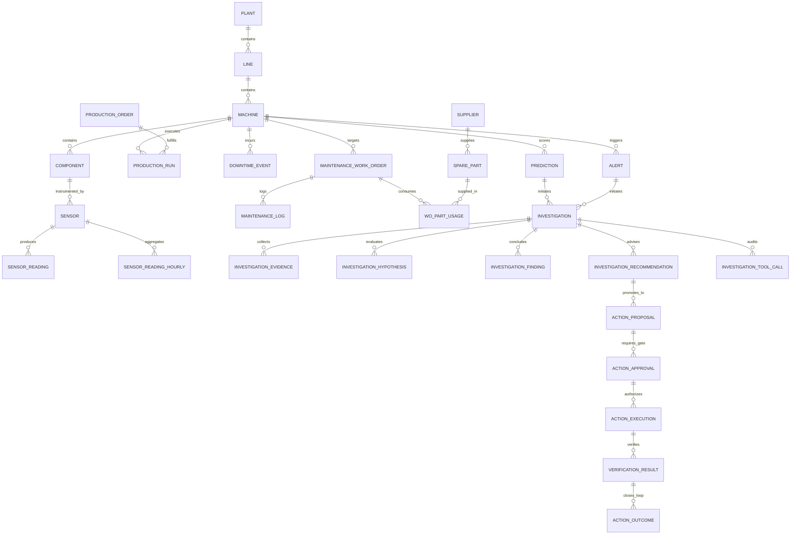

# DeRule Domain Ontology

**Document:** `architecture/ontology.md`
**Version:** 2.0
**Status:** Authoritative Domain Ontology
**Product:** DeRule - *Detect. Investigate. Act*
**Authoritative Platform:** Snowflake (`COCO_FACTORY`)
**Application Tier:** Streamlit

---

# 1. Purpose & Scope

The **DeRule Domain Ontology** establishes the formal semantic vocabulary, entity definitions, structural relationships, operational lifecycles, and persistence contracts for the DeRule industrial reliability and operations command center.

It bridges four operational boundaries:
1. **Physical & Industrial OT / IT Systems:** Sensors, PLCs, machine states, production schedules, maintenance records, and inventory.
2. **Snowflake Authoritative Data Platform:** The single source of truth across conformed relational entities, analytical rollups, feature stores, and document stores.
3. **AI-Assisted Investigation Layer:** Governed, typed read tools producing structured, evidence-grounded hypotheses, findings, and advisory recommendations.
4. **Governed Action & Physical Verification Layer:** Explicit proposal handoffs, human approval gates, actor-validated execution boundaries, closed-loop telemetry verification, and outcome tracking.

```text
┌────────────────────────────────────────────────────────────────────────┐
│                   PHYSICAL FACTORY ASSETS & SENSORS                    │
└───────────────────────────────────┬────────────────────────────────────┘
                                    │
                                    ▼
┌────────────────────────────────────────────────────────────────────────┐
│                     SNOWFLAKE (COCO_FACTORY)                           │
│  RAW ───► CORE ───► ANALYTICS / ML / KNOWLEDGE ───► APP               │
└───────────────────────────────────┬────────────────────────────────────┘
                                    │
                                    ▼
┌────────────────────────────────────────────────────────────────────────┐
│             DERULE TYPED READ TOOLS & INVESTIGATION SERVICE            │
│  (M4 Boundary: Strictly READ-Only / Cortex Evidence Synthesis)        │
└───────────────────────────────────┬────────────────────────────────────┘
                                    │
                                    ▼
┌────────────────────────────────────────────────────────────────────────┐
│             DERULE GOVERNED ACTION & VERIFICATION GATEWAY              │
│  (M5 Boundary: ActionProposal ──► Human Approval ──► Verification)     │
└────────────────────────────────────────────────────────────────────────┘
```

---

# 2. Entity Categorization & Governance Boundaries

DeRule categorizes entities into four distinct semantic domains to eliminate ambiguity and prevent semantic drift:

| Category | Primary Description | Mutability / Authority | Authoritative Location |
| :--- | :--- | :--- | :--- |
| **Canonical Source Entities** | Master records of plant assets, operational schedules, maintenance logs, supply chain components, and documentation. | Read-Only to Agents / Ingested via data pipelines | `COCO_FACTORY.CORE` |
| **Derived Analytics & ML** | Rolling statistical baselines, OEE rollups, feature store vectors, and ML failure risk predictions. | Periodically scored / Deterministic models | `COCO_FACTORY.ANALYTICS`, `COCO_FACTORY.ML` |
| **AI Investigation Artifacts** | Transient and persisted evidence, evaluated hypotheses, diagnostic findings, and **advisory-only** recommendations. | Agent-synthesized / M4 Read-Only Boundary | `COCO_FACTORY.APP` |
| **Governed Action Artifacts** | Formal proposals, human approval audits, mutation execution receipts, closed-loop telemetry verifications, and learning outcomes. | Governed Lifecycle / Human Approval Required | `COCO_FACTORY.APP` |

---

# 3. Factory Core Entities

## 3.1 Plant
* **Purpose:** Top-level physical manufacturing facility hosting production lines and operational infrastructure.
* **Identifier:** `plant_id` (e.g., `PLANT-01`)
* **Key Attributes:** `plant_name` (VARCHAR), `location` (VARCHAR), `timezone` (VARCHAR).
* **Relationships:**
  * Has many `Line` entities (`1:N`).
* **Authoritative Location:** `COCO_FACTORY.CORE.MACHINE` (denormalized attribute) and hierarchy views.

## 3.2 Production Line
* **Purpose:** A sequenced collection of work centers and machines dedicated to manufacturing specific product families.
* **Identifier:** `line_id` (e.g., `LINE-01`, `LINE-02`)
* **Key Attributes:** `line_name` (VARCHAR), `plant_id` (VARCHAR), `target_oee` (FLOAT).
* **Relationships:**
  * Belongs to `Plant` (`N:1`).
  * Contains many `Machine` entities (`1:N`).
* **Authoritative Location:** `COCO_FACTORY.CORE.MACHINE` (denormalized attribute) and `ANALYTICS` views.

## 3.3 Machine
* **Purpose:** The fundamental unit of operational production and asset reliability tracking.
* **Identifier:** `machine_id` (e.g., `M21`, `M15`, `M05`, `M01`–`M25`)
* **Key Attributes:**
  * `machine_name`: Descriptive display name (e.g., *Grinder 3*, *CNC Lathe 2*).
  * `machine_type`: Functional classification (e.g., `Grinder`, `CNC Lathe`, `Milling Machine`).
  * `model`: Manufacturer equipment model (VARCHAR).
  * `criticality`: Operational priority (`CRITICAL`, `HIGH`, `MEDIUM`, `LOW`).
  * `ideal_cycle_time_sec`: Rated operational speed for OEE calculation (FLOAT).
  * `rated_power_kw`: Nameplate power consumption (FLOAT).
  * `pm_interval_days`: Scheduled preventive maintenance cadence (INT).
* **Relationships:**
  * Belongs to `Production Line` (`N:1`).
  * Has many `Component` entities (`1:N`).
  * Has many `Sensor` entities (`1:N`).
  * Subject of `ProductionRun`, `DowntimeEvent`, `MaintenanceWorkOrder`, `Alert`, `Prediction`, and `Investigation`.
* **Authoritative Location:** `COCO_FACTORY.CORE.MACHINE`
* **Lifecycle:** `INSTALLED` → `COMMISSIONED` → `OPERATING` → `DEGRADED` → `UNDER_MAINTENANCE` → `RETIRED`.

## 3.4 Component
* **Purpose:** Sub-assembly or serviceable mechanical/electrical unit within a machine.
* **Identifier:** `component_id` (e.g., `C-M21-BRG`, `C-M15-MTR`, `C-M05-CLT`)
* **Key Attributes:**
  * `component_type`: Classification (e.g., `Drive-End Bearing`, `Drive Motor`, `Hydraulic Pump`, `Coolant Pump`).
  * `model`: Manufacturer component part number (VARCHAR).
  * `expected_life_hrs`: Rated operational lifespan (FLOAT).
  * `operating_hours_used`: Cumulative operating hours logged (FLOAT).
* **Relationships:**
  * Belongs to `Machine` (`N:1`).
  * Associated with `Sensor` entities (`1:N`).
  * Linked to compatible `SparePart` entities (`N:M`).
* **Authoritative Location:** `COCO_FACTORY.CORE.COMPONENT`

## 3.5 Sensor
* **Purpose:** Physical telemetry transducer measuring physical process or health signals on a component or machine.
* **Identifier:** `sensor_id` (e.g., `S-M21-VIB-01`, `S-M21-TMP-01`)
* **Key Attributes:**
  * `sensor_type`: Engineering signal type (e.g., `vibration_rms`, `bearing_temperature`, `motor_current`, `coolant_flow`).
  * `unit`: Physical unit of measure (e.g., `mm/s`, `°C`, `A`, `L/min`).
  * `sampling_rate_hz`: Telemetry sampling frequency (FLOAT).
  * `warn_threshold`: Statistical or engineering warning limit (FLOAT).
  * `crit_threshold`: Critical escalation threshold (FLOAT).
  * `threshold_direction`: `UPPER` or `LOWER`.
* **Relationships:**
  * Installed on `Machine` (`N:1`) and `Component` (`N:1`).
  * Produces `SensorReading` records (`1:N`).
* **Authoritative Location:** `COCO_FACTORY.CORE.SENSOR`

## 3.6 Sensor Reading & Hourly Aggregate
* **Purpose:** Time-series telemetry observations capturing physical operating dynamics.
* **Identifiers:** Composite (`sensor_id`, `ts`).
* **Key Attributes (Raw Minute Stream):**
  * `value`: Instantaneous physical reading (FLOAT).
* **Key Attributes (Hourly Aggregate):**
  * `run_fraction`: Ratio of hour machine was actively in production (FLOAT, `0.0`–`1.0`).
  * `avg_running`: Mean value filtered strictly to active production periods (FLOAT).
  * `min_running`: Minimum running value (FLOAT).
  * `max_running`: Maximum running value (FLOAT).
* **Relationships:**
  * Sourced from `Sensor` (`N:1`).
  * Aggregated into `ML.MACHINE_FEATURE_DAILY` feature store vectors.
* **Authoritative Location:**
  * Raw minute: `COCO_FACTORY.CORE.SENSOR_READING`
  * Hourly aggregate: `COCO_FACTORY.CORE.SENSOR_READING_HOURLY`

## 3.7 Alert
* **Purpose:** Operational notification triggered by threshold breaches, model risk spikes, or anomaly detection.
* **Identifier:** `alert_id` (e.g., `ALT-001142`)
* **Key Attributes:**
  * `severity`: `CRITICAL`, `WARNING`, `INFO`.
  * `alert_type`: `THRESHOLD_EXCEEDED`, `PREDICTED_FAILURE`, `ANOMALY_DETECTED`.
  * `reading_value` & `threshold_value`: Values at alert trigger time.
  * `status`: Operational state (`OPEN`, `ACKNOWLEDGED`, `CLOSED`).
  * `priority_score`: Calculated escalation priority (FLOAT).
* **Relationships:**
  * Targets `Machine`, optional `Component`, optional `Sensor` (`N:1`).
  * Triggers `InvestigationRequest` in the application tier.
* **Authoritative Location:** `COCO_FACTORY.CORE.ALERT`
* **Lifecycle:** `OPEN` → `ACKNOWLEDGED` → `INVESTIGATING` → `ACTION_PROPOSED` → `RESOLVED` → `CLOSED`.

## 3.8 Prediction
* **Purpose:** Supervised machine learning risk forecast estimating failure probability within a specified time horizon.
* **Identifier:** `prediction_id` (e.g., `PRED-000322`)
* **Key Attributes:**
  * `scored_ts`: Timestamp when inference was executed (TIMESTAMP_NTZ).
  * `machine_id`: Asset evaluated (VARCHAR).
  * `suspected_component_id`: Target component flagged by feature attribution (VARCHAR).
  * `model_name`: Model identifier (e.g., `hgb_failure_7d_v1`).
  * `horizon_days`: Forward forecast horizon (typically 7 days / 168 hours).
  * `failure_prob`: Calibrated failure probability (`0.0`–`1.0`).
  * `risk_level`: Classified risk band (`HIGH` $\ge 0.70$, `MEDIUM` $0.40$–$0.69$, `LOW` $< 0.40$).
  * `top_features`: JSON or serialized top contributing features.
* **Relationships:**
  * Evaluates `Machine` and `Component` (`N:1`).
  * Traced to `ML.PREDICTION_LINEAGE` and `ML.PREDICTION_FEATURE_SNAPSHOT`.
  * Input trigger or evidence for `Investigation`.
* **Authoritative Location:** `COCO_FACTORY.CORE.PREDICTION` (Operational Fact) and `COCO_FACTORY.ML.INFERENCE_LOG`.

## 3.9 Failure Mode
* **Purpose:** Standardized taxonomy describing physical failure mechanisms and symptom signatures.
* **Identifier:** `failure_code` (e.g., `BD-BRG`, `BD-MTR`, `BD-HYD`, `BD-CLT`, `BD-DRV`).
* **Canonical Taxonomy:**
  * `BD-BRG`: Bearing mechanical degradation / spalling / lubrication breakdown.
  * `BD-MTR`: Motor stator/rotor winding degradation or electrical imbalance.
  * `BD-HYD`: Hydraulic pump pressure loss / cavitation.
  * `BD-CLT`: Coolant flow restriction / thermal dissipation failure.
  * `BD-DRV`: Mechanical drive belt / coupling slippage or misalignment.
  * `PM-ROUTINE`: Scheduled preventive maintenance.
* **Relationships:**
  * Associated with `Component` types, `MaintenanceWorkOrder`, `Prediction`, `Hypothesis`, and `Finding`.
* **Authoritative Location:** Referenced across `CORE.MAINTENANCE_LOG`, `CORE.MAINTENANCE_WORK_ORDER`, and `KNOWLEDGE.CORPUS`.

## 3.10 Maintenance Work Order
* **Purpose:** Official authorized operational task authorizing technician labor, parts replacement, and downtime.
* **Identifier:** `wo_id` (e.g., `WO-000638`)
* **Key Attributes:**
  * `wo_type`: `CORRECTIVE`, `PREVENTIVE`, `INSPECTION`, `EMERGENCY`.
  * `priority`: `CRITICAL`, `HIGH`, `MEDIUM`, `LOW`.
  * `status`: `OPEN`, `SCHEDULED`, `IN_PROGRESS`, `COMPLETED`, `CLOSED`.
  * `scheduled_date`, `opened_ts`, `started_ts`, `closed_ts`.
  * `assigned_to`: Lead technician identifier (VARCHAR).
  * `labor_hours`, `parts_cost`, `labor_cost`, `cost`: Financial and labor metrics.
* **Relationships:**
  * Performed on `Machine` and `Component` (`N:1`).
  * Generates `MaintenanceLog` (`1:1` or `1:N`).
  * Consumes parts via `WO_PART_USAGE` (`1:N`).
  * Can be instantiated from an approved `ActionProposal`.
* **Authoritative Location:** `COCO_FACTORY.CORE.MAINTENANCE_WORK_ORDER`
* **Lifecycle:** `OPEN` → `SCHEDULED` → `IN_PROGRESS` → `COMPLETED` → `CLOSED`.

## 3.11 Maintenance Log
* **Purpose:** Narrative and technical record documented by technicians upon executing maintenance tasks.
* **Identifier:** `log_id` (e.g., `LOG-000612`)
* **Key Attributes:**
  * `log_ts`: Timestamp of completion.
  * `symptom`: Observed physical symptoms before intervention (VARCHAR).
  * `action_taken`: Explicit corrective steps performed (VARCHAR).
  * `root_cause_category`: Categorized underlying issue (VARCHAR).
  * `downtime_min`: Total maintenance downtime duration (FLOAT).
  * `note_text`: Unstructured technician free-text observations.
* **Relationships:**
  * Belongs to `MaintenanceWorkOrder` (`N:1`).
  * Linked to `Technician` (`N:1`).
* **Authoritative Location:** `COCO_FACTORY.CORE.MAINTENANCE_LOG`

## 3.12 Technician
* **Purpose:** Qualified plant maintenance or reliability personnel authorized to perform work orders.
* **Identifier:** `technician_id` (e.g., `TECH-01` through `TECH-06`).
* **Key Attributes:** `name` (VARCHAR), `skill_area` (VARCHAR: Mechanical, Electrical, Hydraulic), `shift` (VARCHAR), `hourly_rate_inr` (NUMBER).
* **Relationships:**
  * Assigned to `MaintenanceWorkOrder` and authored `MaintenanceLog`.
* **Authoritative Location:** `COCO_FACTORY.CORE.TECHNICIAN`

## 3.13 Spare Part
* **Purpose:** Physical maintenance replacement item held in plant inventory or procured from suppliers.
* **Identifier:** `part_id` (e.g., `SP-002`)
* **Key Attributes:**
  * `part_name`: Technical name (e.g., *Drive-End Bearing 6206-2RS*).
  * `part_category`: Component family (e.g., `BEARING`, `MOTOR`, `SEAL`).
  * `compatible_model`: Machine compatibility specifications.
  * `unit_cost_inr`: Cost per unit in Indian Rupees (NUMBER).
  * `stock_qty`: Current quantity physically on-hand (INT).
  * `reorder_level` & `reorder_qty`: Min stock thresholds.
  * `lead_time_days`: Expected vendor delivery timeframe (INT).
  * `warehouse_bin`: Physical storage location (VARCHAR).
* **Relationships:**
  * Procured via `PurchaseOrder` (`1:N`).
  * Supplied by `Supplier` (`N:1`).
  * Consumed in `WO_PART_USAGE` (`1:N`).
* **Authoritative Location:** `COCO_FACTORY.CORE.SPARE_PART`

## 3.14 Supplier
* **Purpose:** External vendor supplying replacement parts, raw materials, or specialized maintenance services.
* **Identifier:** `supplier_id` (e.g., `SUP-12`).
* **Key Attributes:** `supplier_name` (VARCHAR), `country` (VARCHAR), `avg_lead_time_days` (FLOAT), `on_time_delivery_pct` (FLOAT).
* **Relationships:**
  * Supplies `SparePart` records (`1:N`).
  * Fulfills `PurchaseOrder` records (`1:N`).
* **Authoritative Location:** `COCO_FACTORY.CORE.SUPPLIER`

## 3.15 Purchase Order
* **Purpose:** Commercial procurement document reserving or ordering spare parts from a vendor.
* **Identifier:** `po_id` (e.g., `PO-000217`).
* **Key Attributes:** `qty` (INT), `order_date`, `expected_delivery_date`, `actual_delivery_date`, `status` (`ORDERED`, `SHIPPED`, `RECEIVED`, `CANCELLED`).
* **Relationships:**
  * Orders a `SparePart` from a `Supplier` (`N:1`).
  * Optionally linked to a `MaintenanceWorkOrder` (`N:1`).
* **Authoritative Location:** `COCO_FACTORY.CORE.PURCHASE_ORDER`

## 3.16 Production Order
* **Purpose:** ERP commercial manufacturing order defining volume requirements and delivery deadlines.
* **Identifier:** `production_order_id` (e.g., `PRD-01278`).
* **Key Attributes:**
  * `customer`: Customer or commercial account name (VARCHAR).
  * `planned_qty` & `produced_qty`: Production quotas and fulfillment counts (INT).
  * `due_date`: Contractual delivery target (TIMESTAMP_NTZ).
  * `priority`: `CRITICAL`, `EXPEDITE`, `STANDARD`.
  * `status`: `PLANNED`, `IN_PRODUCTION`, `COMPLETED`, `DELAYED`.
* **Relationships:**
  * Manufactures `Product` on assigned `Machine` (`N:1`).
  * Fulfilled across multiple `ProductionRun` records (`1:N`).
* **Authoritative Location:** `COCO_FACTORY.CORE.PRODUCTION_ORDER`

## 3.17 Production Run
* **Purpose:** Shift-level physical manufacturing execution block on a specific machine.
* **Identifier:** `run_id` (e.g., `RUN-019590`).
* **Key Attributes:**
  * `shift_date` & `shift_id`: Shift context.
  * `planned_time_min`, `run_time_min`, `unplanned_downtime_min`: Time accounting for OEE.
  * `total_count`, `good_count`, `reject_count`: Production output and scrap metrics.
* **Relationships:**
  * Occurs on `Machine` executing `ProductionOrder` (`N:1`).
  * Experiences `DowntimeEvent` records (`1:N`).
* **Authoritative Location:** `COCO_FACTORY.CORE.PRODUCTION_RUN`

## 3.18 Downtime Event
* **Purpose:** Unplanned or planned stoppage interrupting machine availability.
* **Identifier:** `event_id` (e.g., `DT-067384`).
* **Key Attributes:**
  * `reason_code`: Classification code (e.g., `JAM`, `MECHANICAL_BREAKDOWN`, `CHANGEOVER`).
  * `category`: `UNPLANNED_DOWNTIME`, `PLANNED_MAINTENANCE`, `OPERATIONAL_DELAY`.
  * `start_ts` & `end_ts`: Duration interval.
  * `duration_min`: Stoppage time (FLOAT).
  * `wo_id`: Associated corrective work order if applicable.
* **Relationships:**
  * Occurs on `Machine` during `ProductionRun` (`N:1`).
* **Authoritative Location:** `COCO_FACTORY.CORE.DOWNTIME_EVENT`

## 3.19 Product
* **Purpose:** Finished good or intermediate SKU produced by plant lines.
* **Identifier:** `product_id` (e.g., `PRD-SKU-004`).
* **Key Attributes:** `product_name` (VARCHAR), `product_family` (VARCHAR), `unit_price_inr` (NUMBER), `unit_margin_inr` (NUMBER).
* **Relationships:**
  * Target of `ProductionOrder` (`1:N`).
* **Authoritative Location:** `COCO_FACTORY.CORE.PRODUCT`

## 3.20 Knowledge Document
* **Purpose:** Unstructured or semi-structured engineering asset (SOP, OEM troubleshooting manual, policy).
* **Identifier:** `doc_id` (e.g., `DOC-GRIND-001`).
* **Key Attributes:** `doc_type` (`SOP`, `OEM_MANUAL`, `TROUBLESHOOTING`), `title`, `content` (VARCHAR/TEXT).
* **Relationships:**
  * Ingested into `KNOWLEDGE.CORPUS` with chunking and embeddings for vector retrieval.
  * Retrieved by `SearchKnowledgeTool` during investigations.
* **Authoritative Location:** `COCO_FACTORY.CORE.KNOWLEDGE_DOC` and `COCO_FACTORY.KNOWLEDGE.CORPUS`.

---

# 4. AI Investigation Ontology (M4 Read-Only)

All entities in the Investigation Ontology are created under the **M4 Read Boundary**. They represent analytical diagnosis, evidence assembly, and advisory guidance. **They have zero mutation authority over physical factory assets or work orders.**

```text
Investigation (Master Record)
  ├── Evidence (Telemetry, Sensor, Risk, History, SOPs)
  ├── Hypothesis (Differential Diagnosis: Supported / Refuted)
  ├── Finding (Synthesized Root Cause & Context)
  ├── Recommendation (Strictly ADVISORY guidance)
  └── Tool Call (Audited execution of typed M4 read tools)
```

## 4.1 Investigation
* **Purpose:** The master record of an analytical root-cause investigation into an asset anomaly or failure prediction.
* **Identifier:** `investigation_id` (e.g., `INV-M21-20261002-001`).
* **Key Attributes:**
  * `trigger_type`: `PREDICTION`, `ALERT`, `MANUAL_OPERATOR`.
  * `trigger_id`: Originating prediction or alert identifier.
  * `machine_id` & `component_id`: Target asset under investigation.
  * `status`: `CREATED`, `IN_PROGRESS`, `COMPLETED`, `FAILED`.
  * `confidence`: Overall diagnostic confidence score (`0.0`–`1.0`).
  * `summary`: Executive diagnostic overview.
  * `limitations`: Explicit array of diagnostic uncertainties or missing sensors.
  * `provenance`: Execution metadata (Cortex model used, timestamps, prompt version).
* **Authoritative Location:** `COCO_FACTORY.APP.INVESTIGATION`
* **Lifecycle:** `CREATED` → `IN_PROGRESS` → `COMPLETED` (Status in UI: `ADVISORY`).

## 4.2 Evidence
* **Purpose:** An atomic, verifiable operational fact extracted via typed read tools from Snowflake.
* **Identifier:** `evidence_id` (e.g., `EVD-001`).
* **Key Attributes:**
  * `evidence_type`: `TELEMETRY`, `ANOMALY`, `RISK`, `MAINTENANCE`, `FAILURE_HISTORY`, `PRODUCTION`, `INVENTORY`, `DOCUMENT`.
  * `source`: Specific table, tool, or document chunk.
  * `metric`: Measured metric (e.g., `vibration_rms`, `stock_qty`, `exposure_inr`).
  * `observed_value`: Exact observed data value (e.g., `0.92 mm/s`, `0 units`).
  * `relationship`: `SUPPORTS`, `CONTRADICTS`, `CONTEXTUAL`.
  * `claim`: Structured assertion supported by the fact.
* **Authoritative Location:** `COCO_FACTORY.APP.INVESTIGATION_EVIDENCE`

## 4.3 Hypothesis
* **Purpose:** A candidate failure mode or operational explanation evaluated during differential diagnosis.
* **Identifier:** `hypothesis_id` (e.g., `HYP-001`).
* **Key Attributes:**
  * `hypothesis_name`: Descriptive title (e.g., *Drive-End Bearing Mechanical Degradation*).
  * `failure_mode`: Candidate failure taxonomy code (`BD-BRG`, `BD-MTR`, etc.).
  * `confidence`: Evaluated posterior confidence (`0.0`–`1.0`).
  * `status`: `SUPPORTED`, `REFUTED`, `INCONCLUSIVE`.
  * `rationale`: Analytical reasoning synthesizing evidence.
  * `supporting_evidence_ids` & `contradicting_evidence_ids`: Explicit citations.
* **Authoritative Location:** `COCO_FACTORY.APP.INVESTIGATION_HYPOTHESIS`

## 4.4 Finding
* **Purpose:** The conclusive diagnostic determination regarding component condition, historical recurrence, and business exposure.
* **Identifier:** `finding_id` (e.g., `FND-001`).
* **Key Attributes:**
  * `summary`: Core diagnostic finding.
  * `observed_facts`: Array of verified empirical observations.
  * `inferences`: Inferred mechanical or operational states.
  * `evidence_refs`: Array of supporting `evidence_id` foreign keys.
* **Authoritative Location:** `COCO_FACTORY.APP.INVESTIGATION_FINDING`

## 4.5 Recommendation
* **Purpose:** Actionable operational guidance synthesized for human decision-makers.
* **Governance Status:** **STRICTLY ADVISORY.** Recommendations cannot mutate factory records or create work orders autonomously.
* **Identifier:** `recommendation_id` (e.g., `REC-001`).
* **Key Attributes:**
  * `title`: Concise directive (e.g., *Inspect Drive-End Bearing Assembly*).
  * `action_type`: Standardized proposal code (e.g., `INSPECT_BEARING_ASSEMBLY`, `CREATE_WORK_ORDER`, `RESERVE_SPARE_PART`).
  * `priority`: `CRITICAL`, `HIGH`, `MEDIUM`.
  * `status`: Always persisted as `ADVISORY`.
  * `suggested_next_step`: Concrete instruction for technicians.
  * `suggested_parts`: Recommended part numbers (e.g., `SP-002`).
  * `suggested_checklist`: Step-by-step diagnostic checklist.
  * `estimated_downtime_hours`: Estimated maintenance window requirement.
* **Authoritative Location:** `COCO_FACTORY.APP.INVESTIGATION_RECOMMENDATION`

## 4.6 Tool Call
* **Purpose:** Fully auditable record of a typed read tool execution during an investigation.
* **Identifier:** `call_id` (e.g., `TC-001`).
* **Key Attributes:**
  * `tool_name`: Executed tool (e.g., `GetPredictionTool`, `GetInventoryRiskTool`).
  * `tool_mode`: Strictly `ToolMode.READ`.
  * `parameters`: Input JSON arguments.
  * `record_count`: Number of records returned.
  * `duration_ms`: Tool runtime latency in milliseconds.
  * `success`: Boolean execution status.
* **Authoritative Location:** `COCO_FACTORY.APP.INVESTIGATION_TOOL_CALL`

---

# 5. Governed Action & Verification Ontology (M5 Action Boundary)

The **M5 Action Boundary** governs all operational mutations. **No autonomous agent self-approval is permitted.** Every state change follows strict human governance and post-action verification.

```text
ActionProposal ──► Precondition Check ──► ActionApproval (Human Gate)
                         │
                         ├── (Preconditions Fail: EXECUTION_BLOCKED)
                         │
                         ▼ (Approved by Human)
                   ActionExecution ──► Physical Telemetry Verification ──► ActionOutcome
```

## 5.1 Action Proposal
* **Purpose:** A formal request to execute a consequential factory mutation, promoted from an advisory recommendation.
* **Identifier:** `action_proposal_id` (e.g., `PROP-20261002-001`).
* **Key Attributes:**
  * `investigation_id` & `recommendation_id`: Lineage origin.
  * `action_type`: `CREATE_WORK_ORDER`, `RESERVE_SPARE_PART`, `ASSIGN_TECHNICIAN`, `INSPECT_BEARING_ASSEMBLY`.
  * `machine_id` & `component_id`: Target operational assets.
  * `parameters`: Structured payload required for execution.
  * `requires_approval`: True for all consequential actions.
  * `status`: `PROPOSED`, `PENDING_APPROVAL`, `APPROVED`, `REJECTED`, `EXECUTION_BLOCKED`, `EXECUTED`.
  * `idempotency_key`: Unique deduplication key preventing duplicate operational mutations.
* **Authoritative Location:** `COCO_FACTORY.APP.ACTION_PROPOSAL`

## 5.2 Action Approval
* **Purpose:** An immutable governance record capturing an explicit human operator authorization or rejection.
* **Identifier:** `approval_id` (e.g., `APPR-20261002-001`).
* **Key Attributes:**
  * `action_proposal_id`: Governed proposal link.
  * `status`: `PENDING`, `APPROVED`, `REJECTED`, `EXPIRED`.
  * `requested_by`: Proposing entity (e.g., `ReliabilityAgent`).
  * `decision_by`: **Validated human operator identity.** Rejects blank, whitespace, or autonomous/agent actors (e.g., rejects `ReliabilityAgent`, `SYSTEM`).
  * `decision_at`: Timestamp of decision.
  * `decision_reason`: Operator justification or rejection reason.
  * `expires_at`: Mandatory governance expiration deadline.
* **Authoritative Location:** `COCO_FACTORY.APP.ACTION_APPROVAL` and `COCO_FACTORY.APP.APPROVAL_AUDIT`.

## 5.3 Action Execution
* **Purpose:** The physical or operational mutation receipt generated by an authorized execution tool.
* **Identifier:** `execution_id` (e.g., `EXEC-20261002-001`).
* **Key Attributes:**
  * `action_proposal_id` & `approval_id`: Verifiable authorization pedigree.
  * `executed_by`: Validated actor identity.
  * `status`: `SUCCESS`, `FAILED`, `EXECUTION_BLOCKED`.
  * `idempotency_key`: Deduplication check.
  * `result_data`: Mutation receipt (e.g., created `work_order_id`, reserved quantity).
  * `error_message`: Detailed failure diagnostics if blocked or failed.
* **Authoritative Location:** `COCO_FACTORY.APP.ACTION_EXECUTION` and `COCO_FACTORY.APP.ACTION_AUDIT`.

## 5.4 Verification Policy
* **Purpose:** Quantitative criteria defining when an asset is considered mechanically restored based on post-action telemetry.
* **Identifier:** `policy_id` (e.g., `POLICY-VIB-TEMP-DEFAULT`).
* **Key Attributes:**
  * `max_acceptable_vibration_rms`: Post-maintenance vibration limit (e.g., `0.50 mm/s`).
  * `max_acceptable_temperature`: Post-maintenance thermal limit (e.g., `65.0 °C`).
  * `max_acceptable_risk_score`: Maximum allowable failure probability (e.g., `0.25`).
  * `min_vibration_reduction_pct`: Required percentage reduction from pre-maintenance baseline (e.g., `30.0%`).
  * `baseline_window_hours` & `verification_window_hours`: Observation intervals (e.g., 24h).
* **Authoritative Location:** `COCO_FACTORY.APP.VERIFICATION_POLICY`

## 5.5 Verification Result
* **Purpose:** The empirical evaluation of post-maintenance telemetry against the verification policy.
* **Identifier:** `verification_id` (e.g., `VERIF-20261002-001`).
* **Key Attributes:**
  * `work_order_id` & `machine_id`: Asset and maintenance linkage.
  * `pre_vibration_rms` & `post_vibration_rms`: Before/after physical vibration.
  * `pre_temperature_c` & `post_temperature_c`: Before/after thermal readings.
  * `pre_risk_score` & `post_risk_score`: Risk model reduction.
  * `is_recovered`: Boolean flag confirming physical recovery criteria met.
  * `verification_status`: `VERIFIED`, `FAILED`, `INCONCLUSIVE`, `PENDING_DATA`.
  * `verification_reason`: Quantitative audit rationale.
* **Authoritative Location:** `COCO_FACTORY.APP.VERIFICATION_RESULT`

## 5.6 Action Outcome
* **Purpose:** Closed-loop feedback record logging long-term operational impact and generating ground-truth training labels for ML models.
* **Identifier:** `outcome_id` (e.g., `OUT-20261002-001`).
* **Key Attributes:**
  * `action_proposal_id`, `execution_id`, `verification_id`, `work_order_id`, `prediction_id`.
  * `machine_id` & `failure_mode`.
  * `observed_failure_confirmed`: Ground-truth label confirming physical degradation existed.
  * `downtime_avoided_hours`: Quantified operational savings.
  * `verification_status`: Status from `VerificationResult`.
  * `telemetry_provenance`: Provenance dictionary tracking physical telemetry sources.
  * `is_simulated_telemetry`: Boolean indicating synthetic vs. live factory sensor source.
* **Authoritative Location:** `COCO_FACTORY.APP.ACTION_OUTCOME`

---

# 6. Critical Semantic Boundary Matrices

To preserve architectural integrity, engineers and operators must maintain strict distinctions across four boundaries:

### 1. Prediction vs. Investigation
| Dimension | Prediction (`CORE.PREDICTION`) | Investigation (`APP.INVESTIGATION`) |
| :--- | :--- | :--- |
| **Origin** | Supervised scikit-learn ML model (`hgb_failure_7d_v1`). | Agentic orchestration over 13 typed read tools. |
| **Output** | Failure probability ($P \in [0, 1]$), horizon, risk band. | Root cause differential diagnosis, evidence chain, recommendations. |
| **Semantics** | "What is the probability of degradation within 7 days?" | "Why is this asset degrading, what history exists, and what should be done?" |

### 2. Recommendation vs. Action Proposal
| Dimension | Recommendation (`APP.INVESTIGATION_RECOMMENDATION`) | Action Proposal (`APP.ACTION_PROPOSAL`) |
| :--- | :--- | :--- |
| **Authority** | **STRICTLY ADVISORY.** Cannot mutate data or assets. | Formal governance contract submitted for human approval. |
| **Execution** | Non-executable. Informs human review. | Executable by `ActionExecutionService` once approved. |
| **Semantics** | "The AI suggests checking the drive-end bearing." | "Request authorization to issue Work Order WO-000639 for M21." |

### 3. Action Approval vs. Action Execution
| Dimension | Action Approval (`APP.ACTION_APPROVAL`) | Action Execution (`APP.ACTION_EXECUTION`) |
| :--- | :--- | :--- |
| **Owner** | Validated human operator. | Governed execution service using typed action tools. |
| **Responsibility** | Grants policy permission and legal accountability. | Validates preconditions and commits physical/database mutations. |
| **Semantics** | "Operator J. Doe approves WO creation." | "System executes WO creation and returns WO-000639." |

### 4. Verification Result vs. Work Order Completion
| Dimension | Work Order Completion (`CORE.MAINTENANCE_WORK_ORDER`) | Verification Result (`APP.VERIFICATION_RESULT`) |
| :--- | :--- | :--- |
| **Origin** | CMMS / technician closeout timestamp. | Empirical telemetry analysis via `VerificationService`. |
| **Basis** | Administrative completion ("Technician packed tools"). | Physical sensor readings ("Vibration dropped below 0.50 mm/s"). |
| **Semantics** | "Work order closed in CMMS." | "Physical equipment health verified restored." |

---

# 7. Complete Entity Relationship Architecture


